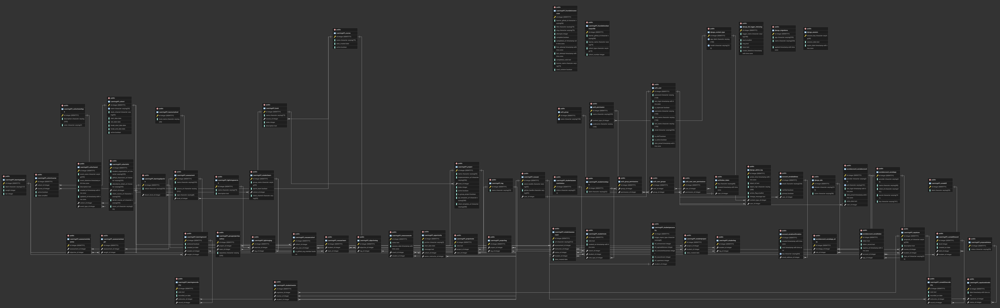

# Data Model

## 1. Database Diagram

## 2. Database Info

**Database type:**

**ORM:**

## 3. Model to Table Mapping

| Model Name | Table Name |
|------------|------------|
| Model 1    |  LearningAPI_assessment                  |
| Model 2    |  LearningAPI_assessmentobjective         |

| Property Name | Column Name | Data Type |
|---------------|-------------|-----------|
|               |    id                  |   interger        |
|               |    assessment_id       |   integer         |
|               |                        |                   |

## 4. Relationship Examples

**One-to-one** (field name: )

| Model Name | Table Name | PK Column | FK Column |
|------------|------------|-----------|-----------|
| Model 1    |            |           |           |
| Model 2    |            |           |           |

**One-to-many** (field name: )

| Model Name | Table Name | PK Column | FK Column |
|------------|------------|-----------|-----------|
| Model 1    |            |           |           |
| Model 2    |            |           |           |

**Many-to-many** (field name: )

| Model Name | Table Name | PK Column | FK Column |
|------------|------------|-----------|-----------|
| Model 1    |            |           |           |
| Model 2    |            |           |           |
| (junction) |            |           |           |