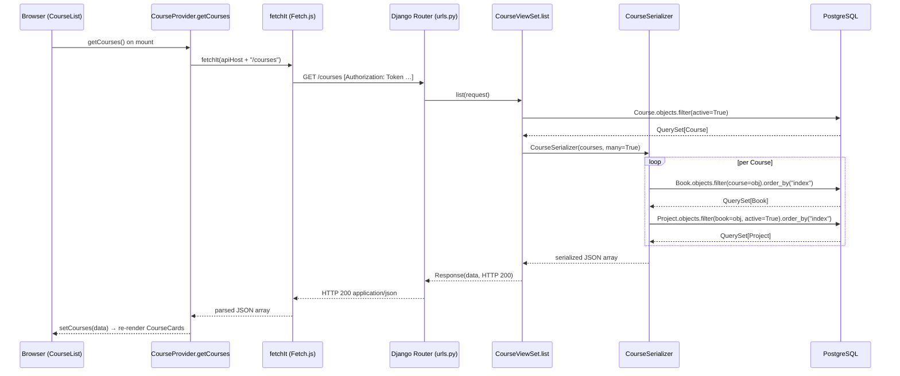

# Trace Notes (AI): courses (learn-ops-api)

### Request path table from Claude

| Layer | File | Class / Function | What it does |
|-------|------|-----------------|--------------|
| UI dialog | [learn-ops-client/src/components/course/CourseList.js](../learn-ops-client/src/components/course/CourseList.js#L17-L19) | `CourseList` — `useEffect` | On mount, calls `getCourses()` and stores the result in local state via `setCourses` |
| API helper | [learn-ops-client/src/components/course/CourseProvider.js](../learn-ops-client/src/components/course/CourseProvider.js#L26-L36) | `getCourses` | Calls `fetchIt(apiHost + "/courses")` — adds the auth token header and returns a promise of JSON |
| Fetch util | [learn-ops-client/src/components/utils/Fetch.js](../learn-ops-client/src/components/utils/Fetch.js#L3-L72) | `fetchIt` | Wraps browser `fetch`; reads the token from localStorage, attaches `Authorization: Token …`, handles 200/201/204 responses |
| URL router | [learn-ops-api/LearningPlatform/urls.py](../learn-ops-api/LearningPlatform/urls.py#L33) | `router.register(r'courses', CourseViewSet, 'course')` | DRF DefaultRouter maps `GET /courses` → `CourseViewSet.list` and `GET /courses/<pk>` → `CourseViewSet.retrieve` |
| View | [learn-ops-api/LearningAPI/views/course_view.py](../learn-ops-api/LearningAPI/views/course_view.py#L104-L124) | `CourseViewSet.list` | Filters `Course.objects.filter(active=True)`, optionally narrows by cohort; increments `course_views_total` Prometheus counter; passes queryset to `CourseSerializer` |
| Serializer | [learn-ops-api/LearningAPI/views/course_view.py](../learn-ops-api/LearningAPI/views/course_view.py#L184-L194) | `CourseSerializer` | Serializes `id, name, date_created, active`; `get_books` triggers two extra DB queries per course — books ordered by index, then active projects per book |
| DB | [learn-ops-api/LearningAPI/models/coursework/course.py](../learn-ops-api/LearningAPI/models/coursework/course.py#L4-L8) | `Course` model | `SELECT * FROM learningapi_course WHERE active=TRUE`; serializer also queries `learningapi_book` and `learningapi_project` (N+1 per course) |
| UI refresh | [learn-ops-client/src/components/course/CourseList.js](../learn-ops-client/src/components/course/CourseList.js#L18) | `getCourses().then(setCourses)` | Promise resolves with the array of courses; React re-renders `CourseCard` for each entry |

### Sequence Diagram

